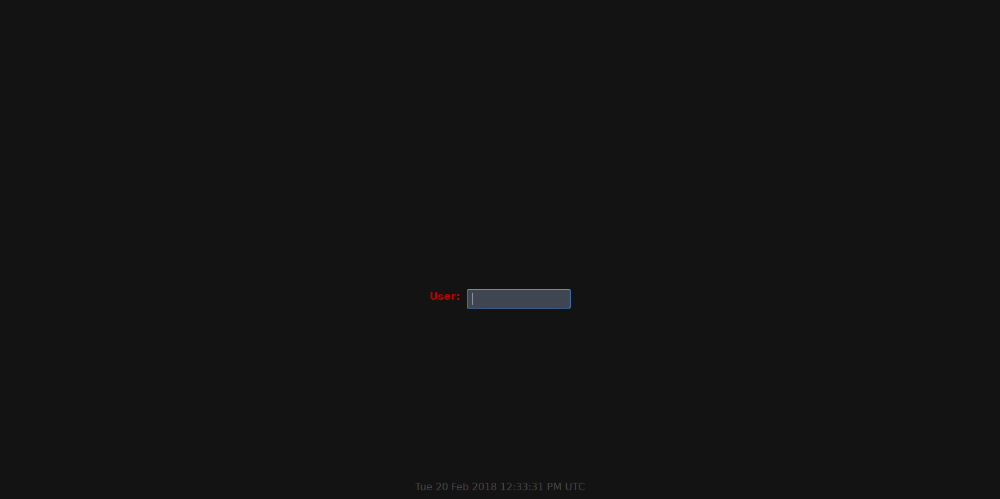
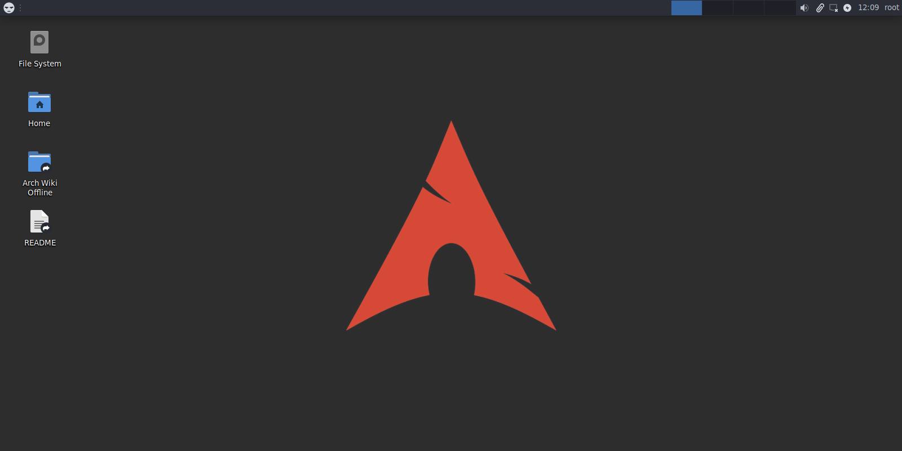
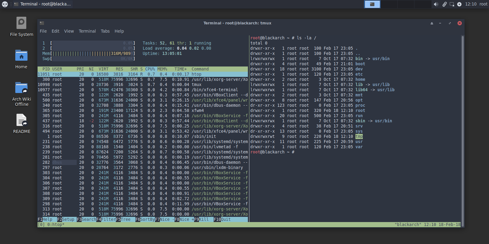
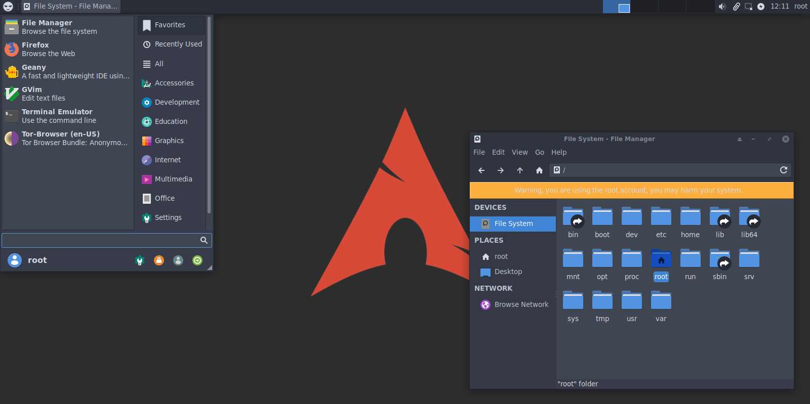

# BlackArch Slim ISO
## A smaller ISO compared to the regular one, with selected packages.

## Image

For testing:
https://mega.nz/#!vpQw2R7T!_553MQ34Y4wV4t5lIQU7SGPxXKsYBz7NKLM-1wncgco


sha1sum: f68bf283cb49fdf8351caf09d452979807342190


ref. to commit: a4e62c7cbe130e2b739c0bf5828771c59ab24352


important: this Live ISO could be out of date, not reflecting the actual state
of the repository.


## Map

- build.sh: Script to create the image.

- packages.x86_64: Default packages to be installed on the Live ISO.

- airootfs/root/customize_airootfs.sh: Script that runs commands on the Live ISO
  during the building process. You can modify this file to run any
  administration command or to modify any configuration file.

## Dependencies

`archiso`: https://www.archlinux.org/packages/extra/any/archiso/

```
# pacman -S archiso
```

## Building the Image

Building the image is only possible on an Arch Linux installation.
Clone the repo and run the following **as root**:

(consider backing up the `out` folder)

```
# cd blackarch-slim-iso
# rm -rfv work/
# mkdir out work
# ./build.sh -v
```

The finished ISO will be located in the `out` folder.

login:
- root:blackarch

Note: make sure to check the README inside Desktop.

## Installation

- The Arch way. Read: https://wiki.archlinux.org/index.php/archiso#Installation_without_Internet_access

Note: following the offline installation guide, you'll have to change this command:

`cp -vaT /run/archiso/bootmnt/arch/boot/$(uname -m)/vmlinuz /mnt/boot/vmlinuz-linux`

to

`cp -vaT /run/archiso/bootmnt/blackarch/boot/$(uname -m)/vmlinuz /mnt/boot/vmlinuz-linux`


- It's also important to mention that offline installation will install
everything that the Live ISO has. It means you'll have applications that you
don't necessarily need, i.e.: gpu drivers, virtualbox modules, etc.
Make sure to do a clean up after, if necessary.


- And YES you can use this same ISO to install Vanilla Arch Linux! Yep!
Just follow the https://wiki.archlinux.org/index.php/installation_guide and you
should be good.


- The Live ISO has Arch Wiki Offline package installed, meaning you can check
all Arch documentation without access to the Internet. Make sure to check it!

## Screenshots (probably out of date)






## Suggestions

- If you have any ideas, please consider opening an issue.
  Make sure to use the description box and write a useful and informative issue.

- If you would like to see an application installed by default in the ISO make
  sure to create an issue or pull request describing why it would be a good idea
  to have that specific tool installed.

